# DeveRamOverclock
My current progress in overclocking RAM

| Step | Zentimings | TM5 | Description | Stable? |
|:----:|:----------:|:---:|:-----------:|:-------:|
| 1 | 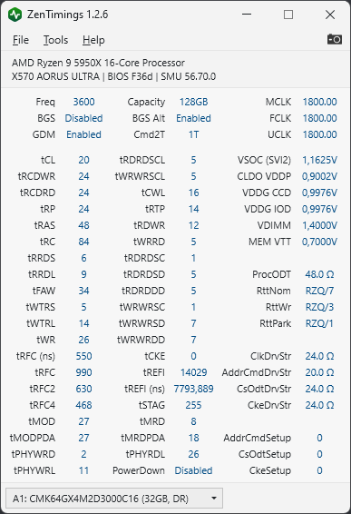 | 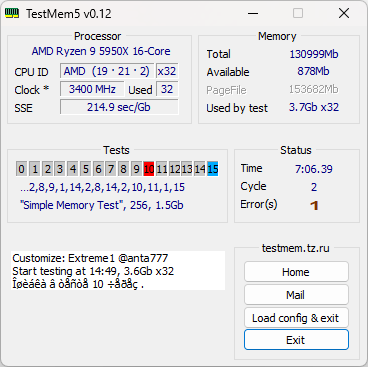 | 3600mhz with increased primary timings | Unstable ~30 hours |
| 2 | 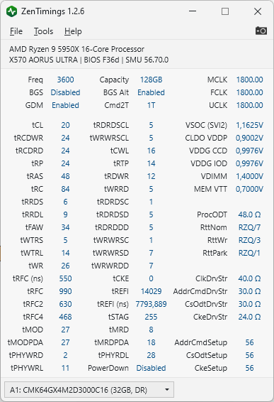 | 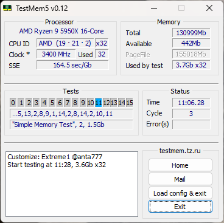 | Changed Setups and DrvStr | Stable ~11 hours |
| 3 | 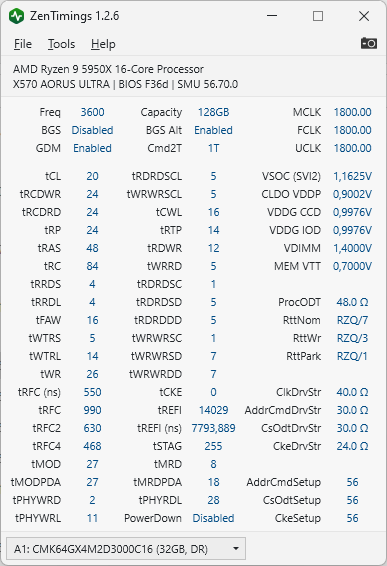 | 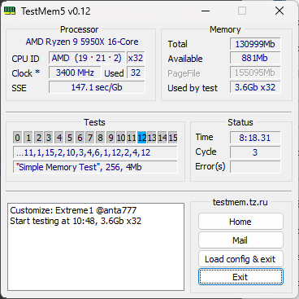 | TFAW 16 / TRRDS 4 / TRRDL 4 | Stable ~8 hours |
| 4 | ?? | ?? | ?? | ?? |
| 5 | 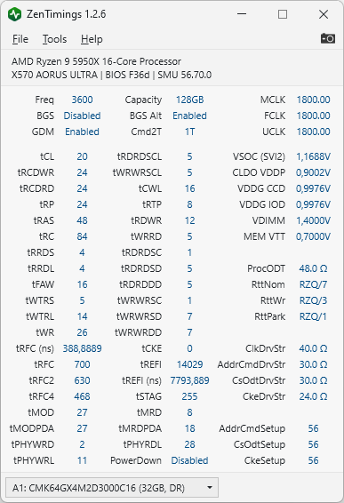 | 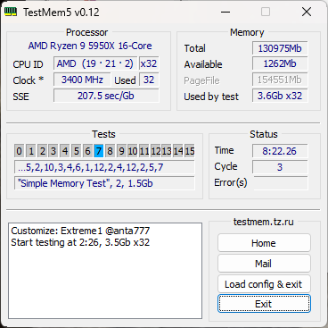 | tRFC 388 | Stable ~8 hours |
| 6 |  | 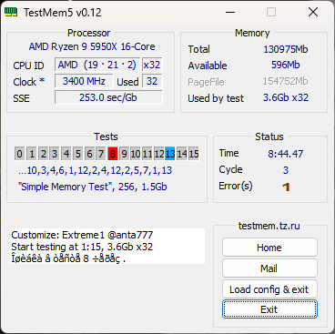 | tWTRS 4 / tWTRL 10 | Unstable ~8 hours |
| 7 |  | 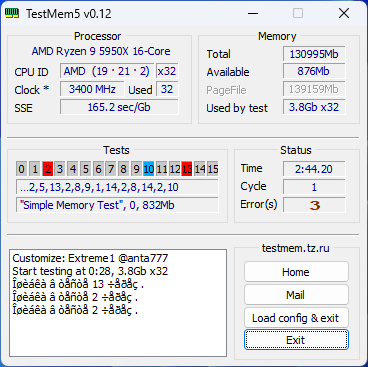 | Setups 59 50 50 | Unstable ~2 hours |
| 8 | 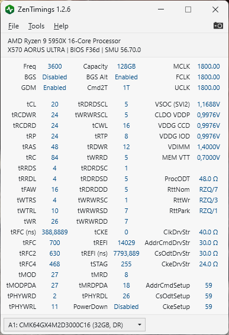 | 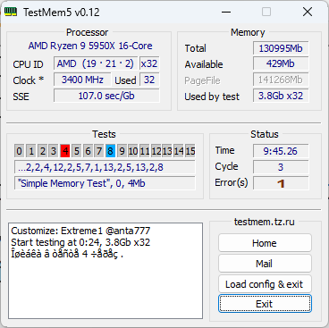 | Setups 59 59 59 | Unstable ~9 hours |
| 9 | 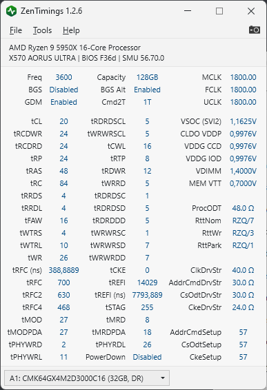 | 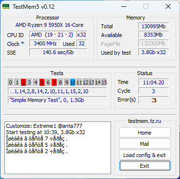 | Setups 57 57 57 | Unstable 11 hours |
| 10 | 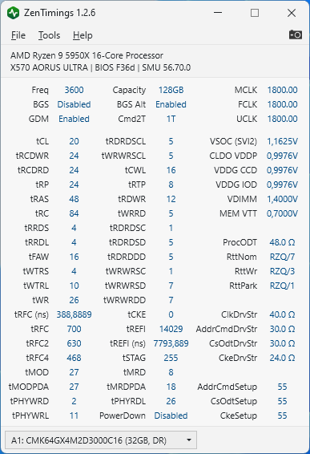 | 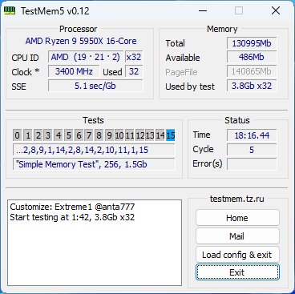 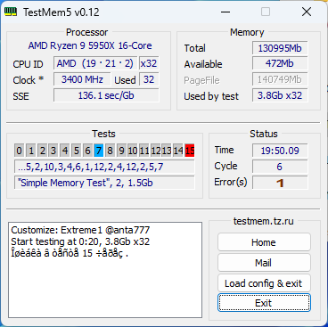 | Setups 55 55 55 | Unstable ~35 hours |
| 11 | 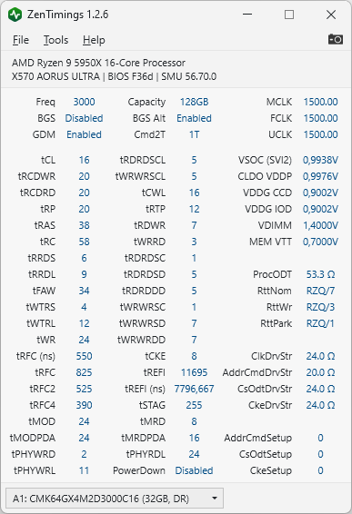 | 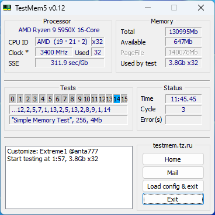 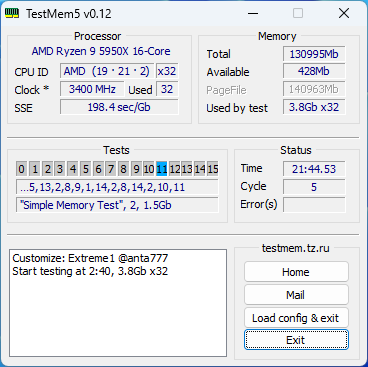 | Back to XMP | Stable ~40+ hours |

## More blah

Blahblahblah
