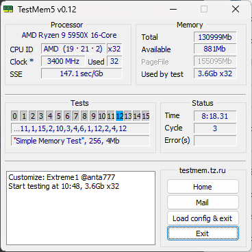

# DeveRamOverclock
My current progress in overclocking RAM

| Step | Zentimings | TM5 | Description | Stable? |
|:----:|:----------:|:---:|:-----------:|:-------:|
| 1 |  |  | 3600mhz with increased primary timings | Unstable ~30 hours |
| 2 |  |  | ... | ... |
| 3 |  |  | ... | ... |
| 4 |  |  | ... | ... |
| 5 |  |  | ... | ... |
| 6 |  |  | ... | ... |
| 7 |  |  | ... | ... |
| 8 |  |  | ... | ... |
| 9 |  |  | ... | ... |
| 10 |  |   | ... | ... |
| 11 |  |   | ... | ... |

## More blah

Blahblahblah
