# DeveRamOverclock

## RAM Information

I currently have 4x 32gb Corsair RAM (only 3 shown in picture below):

Hynix 5.49 MJR

These should be safe for 1.45v

## Goal

My Goal is to overclock these to 3600mhz running semi decent timings.
I'd like to keep the voltages below the presumed safe limits to build in a bit more safety.

My limits:

| Setting | My Safe Voltage | Max Safe Voltage | Reasoning |
|:-------:|:---------------:|:----------------:|:---------:|
| VDDG IOD | 1.00v | 1.05v | 0.05v below the limit (This might be the same as the one below, I'm not sure) |
| VDDP | 1.00v | 1.05v | 0.05v below the limit |
| VDIMM | 1.40v | 1.45v | 0.05v below the limit |

## Progress
My current progress in overclocking RAM

| Step | Zentimings | TM5 | Description | Stable? |
|:----:|:----------:|:---:|:-----------:|:-------:|
| 1 |  |  | 3600mhz with increased primary timings | Unstable ~30 hours |
| 2 |  |  | Changed Setups and DrvStr | Stable ~11 hours |
| 3 |  |  | TFAW 16 / TRRDS 4 / TRRDL 4 | Stable ~8 hours |
| 4 | ?? | ?? | ?? | ?? |
| 5 |  |  | tRFC 388 | Stable ~8 hours |
| 6 |  |  | tWTRS 4 / tWTRL 10 | Unstable ~8 hours |
| 7 |  |  | Setups 59 50 50 | Unstable ~2 hours |
| 8 |  |  | Setups 59 59 59 | Unstable ~9 hours |
| 9 |  |  | Setups 57 57 57 | Unstable 11 hours |
| 10 |  |   | Setups 55 55 55 | Unstable ~35 hours |
| 11 |  |   | Back to XMP | Stable ~40+ hours |
| 12 | 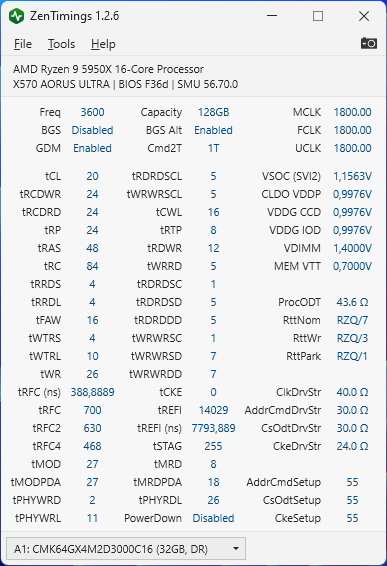 | 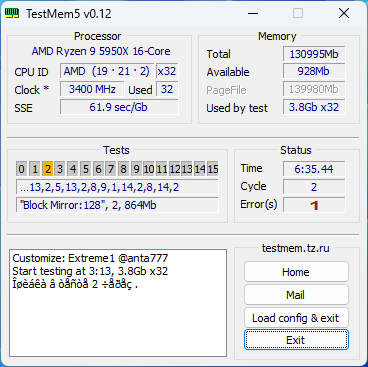 | ProcODT to 43.6 OHM | Errors after ~6 hours |
| 13 |  | 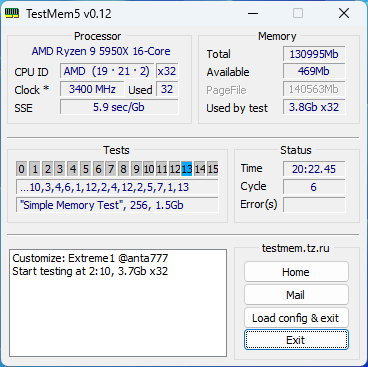 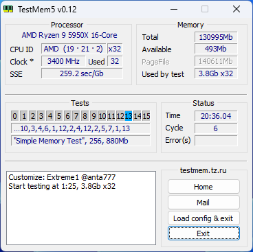 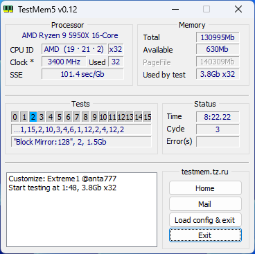 | Decreased frequency to 3533mhz | Stable 50 hours |
| 14 | 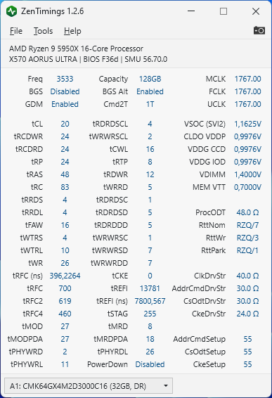 | 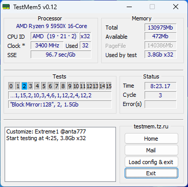 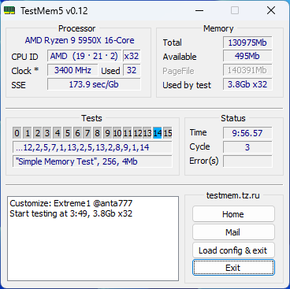 | tRDRDSCL 4, tWRWRSCL 2 | No errors, but bugs in windows |
| 15 |  | 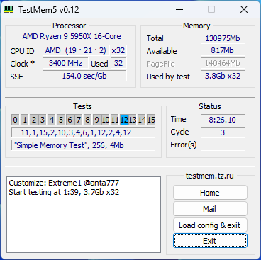 | tWRWRSCL back to 3 | Stable long |
| 16 |  |  | Playing with primaries 1 | ... |
| 17 |  |  | Playing with primaries 2 | ... |
| 18 | 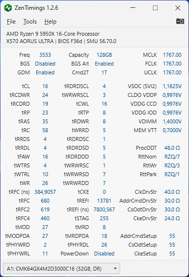 | 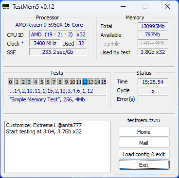 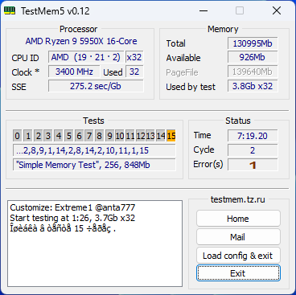 | Lowest primaries that boot | Unstable 25 hours |
| 19 | 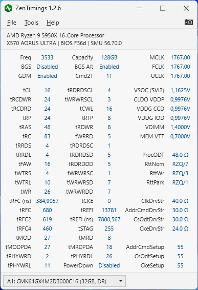 | 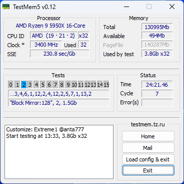 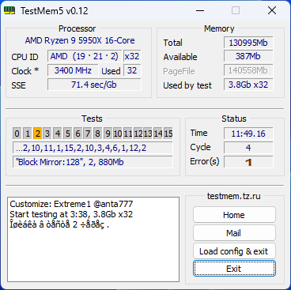 | Primary tCL 19 | Stable 24 hours |

## Next steps

### Figuring out why I'm having errors

Ideas:

| # | Suggested by | Idea | My oppinion |
|:-:|:------------:|:----:|:-----------:|
| 1 | Krunk | VDDP to 0.95v / VDDG IOD to 1.05v | I don't like voltage playing but maybe I can try this |
| 2 | Kermit | Play with setups | Tried it but didn't really solve it (Only tried all setups same timing except 59 50 50) |
| 3 | Kermit | Play with DrvStr | Todo |
| 4 | Stoney | Maybe up the previous timings I tweaked???? (E.g. tRTP 8 ) | Todo |
| 5 | Devedse (me) | Rerun Benchmark 2 for longer to see if this was actually stable | Todo |
| 6 | Devedse (me) | Rerun XMP | Done, seemed to be stable |
| 7 | Kermit | Change ProcODT to 43.6 | Didn't work, unstable after 6 hours |
| 8 | Profile_name_1 | tRRDL 6 / tRTP 10 | Todo |
| 9 | Profile_name_1 | 3533 Mhz | Todo |
| 10 | | Play with GDM Disabled to see if you can figure out what causes instability | Tried, but not much was found |

## More usefull things

Guide:

https://github.com/integralfx/MemTestHelper/blob/oc-guide/DDR4%20OC%20Guide.md#tightening-timings

RFC Timings:

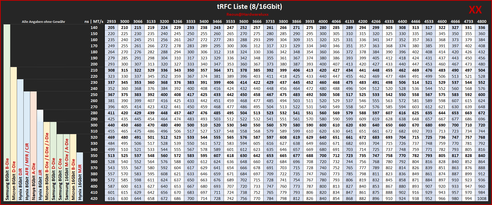

Speed increase per setting:

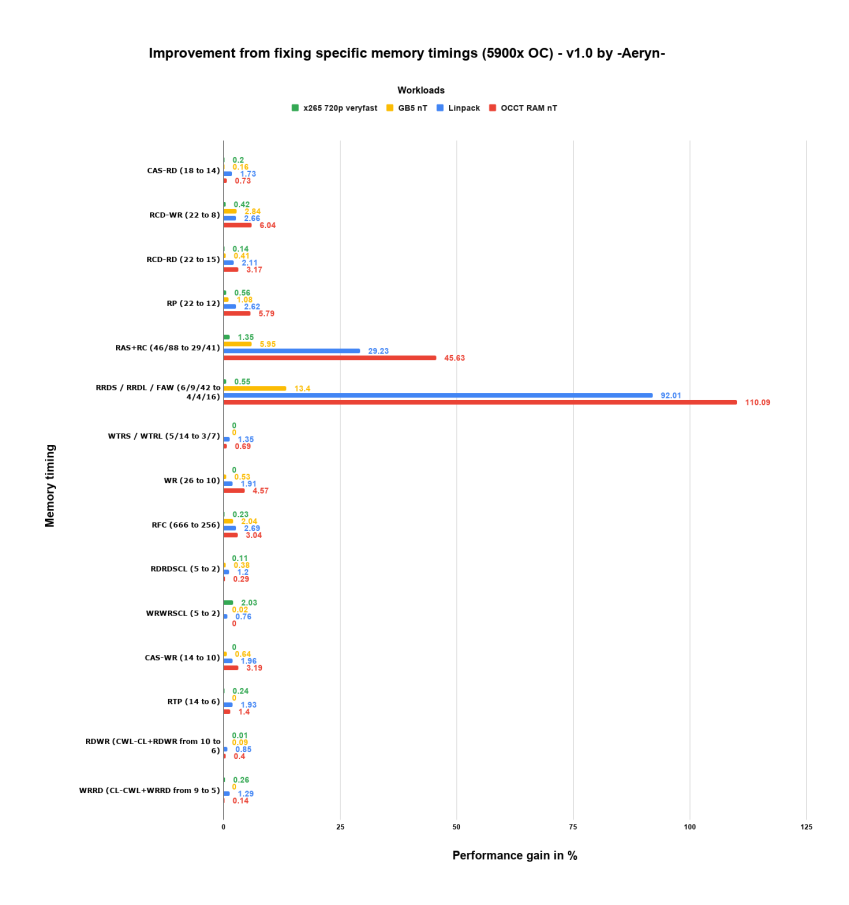

MicroBenchmark:

https://github.com/clamchowder/MicrobenchmarksGui
